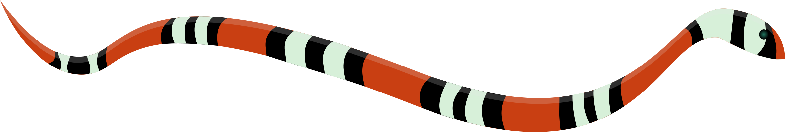

# CORAL Toolbox

The **CO**nstraint-based P**R**omiscuous Enzyme **A**nd Underground Metabolism Mode**L**ling (CORAL) Toolbox is a tool to include promiscuous enzyme activity and underground metabolism in protein-constrained models (pcGEMs) reconstructed in GECKO 3.

## Installation

### Dependencies:

* MATLAB 2019b or later
* [COBRA Toolbox 3.4](https://opencobra.github.io/cobratoolbox/stable/index.html) or later
* [RAVEN Toolbox  2.8.3](https://github.com/SysBioChalmers/RAVEN/releases/tag/v2.8.3) or later
* [GECKO Toolbox  3.1.3](https://github.com/SysBioChalmers/GECKO/releases/tag/v3.1.3) (may not work properly with later versions) 
* Gurobi solver 9.1.1 or later

### How to install:

1. Clone the repository in the desired directory or download the [the latest release](https://github.com/mauricioamf/CORAL/releases) as a ZIP file

## How to use

The [`Protocol.m`](https://github.com/mauricioamf/CORAL/blob/main/Protocol.m) file contains step-by-step instructions on how to run CORAL for your pcGEM to restructure its enzyme usage and include promiscuous enzyme activity.

## Citation

If you use the CORAL Toolbox, please cite:

> Ferreira et al. _Integrating promiscuous enzyme activities in protein-constrained models pinpoints the role of underground metabolism in robustness of metabolic phenotypes_ bioRxiv (2024). [DOI: 10.1101/2024.09.06.611666](https://doi.org/10.1101/2024.09.06.611666)

## Why the name "CORAL"?

This software was named after the short-tailed coral snake, _Micrurus frontalis_, found in South America. This snake has fossorial habits, meaning it digs soil and stays _underground_.
